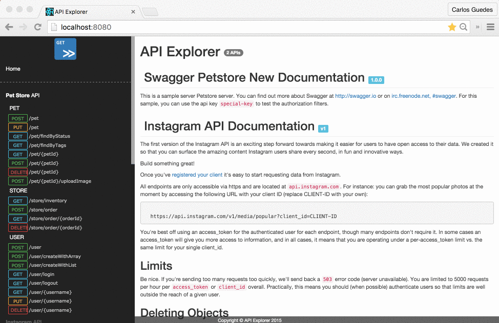

API Explorer
=================

[](https://github.com/feross/standard)
[](https://circleci.com/gh/sky-uk/api-explorer)

**Documentation is in progress**

API Explorer is a live documentation client for Swagger. It provides a nice and highly customizable UI for Swagger.



## Sample Application (development)

You can try the application in our online development sandbox.

[https://apiexplorer-app.herokuapp.com](https://apiexplorer-app.herokuapp.com)

## Features

* Clean UI
* Multiple APIs
* Loaders for Swagger version 1.0 and 2.0
* Custom HTTP Headers
* Extensible tab widgets
* Built-in proxy for bypass CORS restrictions


## Development

### Build

To build this project you need to clone the repo and then:

```
npm install
npm run start:dev
open http://localhost:3000
```

You can change the port number using the `PORT` environment variable.


### Production build

To generate a production build you need to run the following commands:


```
npm install
npm run dev
```

The output files are stored in the `dist` folder. You can grab the files and place then in your application server.

You can also use a local server to run this application using `npm start`


### Linting

This project uses [StandardJS](http://standardjs.com/) for linting the code.

```
npm run lint
```

### Customization

You can customize APIExplorer using the following fluent configuration:

```html
<script src="/apiexplorer.js?s=2317557"></script>
```

```javascript
APIExplorer
  .addAPI('petstore', 'swagger2', 'https://api.swaggerhub.com/apis/anil614sagar/petStore/1.0.0', c => {
    c.addHeader('X-Foo', 'Some Value')
    c.addHeader('X-Bar', 'Another Value')
    c.useProxy(true)
  })
  .addWidgetTab('HATEOAS', APIExplorer.HATEOASWidget)
  .addPlugin(samplePlugin)
  .configCORS({ credentials: 'omit' })
  .start()
```
